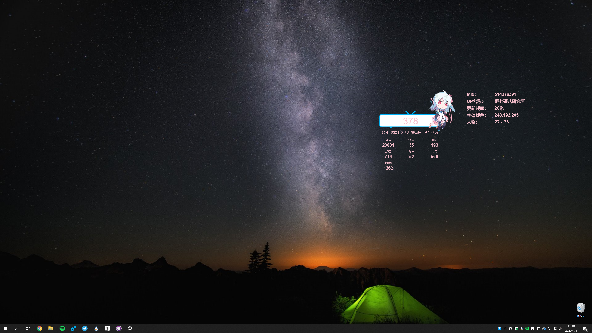
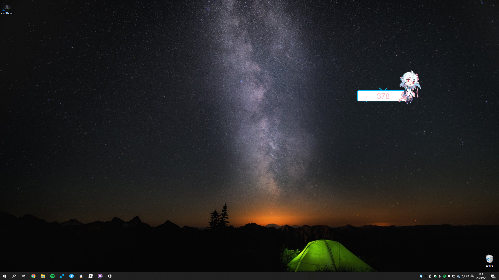

# BilibiliFans4Rainmeter
Show real-time blibili fans for Rainmeter
通过雨滴桌面，在桌面上实时显示粉丝数

### 如何使用
需要先下载安装[雨滴桌面](https://github.com/rainmeter/rainmeter/releases/)，再下载这个[皮肤包](https://github.com/heyxiaobai/BilibiliFans4Rainmeter/releases/)，双击安装后，在设置菜单中更改mid即可使用

### 鼠标功能
* 鼠标预览人物 -- 显示最新一个视频详情
* 鼠标左键点击人物 -- 弹出/关闭设置菜单
* 鼠标中键点击人物并停留2s -- 固定/隐藏视频详情（即切换鼠标预览功能）

### 选项说明（点击参数进行修改）
* mid：打开个人首页，地址栏链接显示如`https://space.bilibili.com/514276391`，其中后面的数字`514276391`则为mid
* up名称：用于校对是否填入正确的mid
* 更新频率：设置多久更新一次粉丝数和视频详情信息，建议设置大于5的数值
* 颜色：可以修改字体显示颜色
* 22/33：点击对应的数字切换人物形象

### 效果预览

